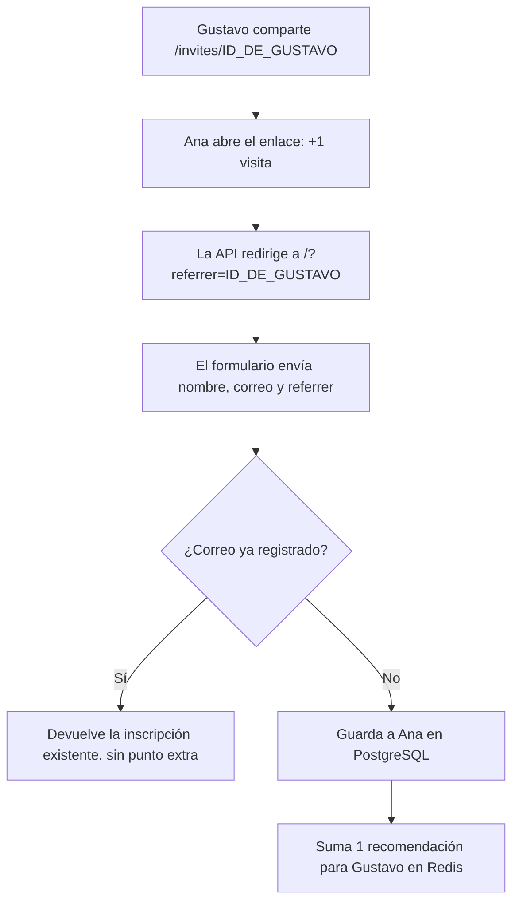

# ¿Cómo funciona? (Visión general)

[English](README.md) · [Português (Brasil)](README.pt-BR.md) · [Español](README.es.md)

**Tu enlace contiene tu identificador. Cuando alguien lo abre, ese identificador acompaña a la persona hasta el envío del formulario. Al guardar una nueva inscripción, la API utiliza ese valor para sumarte una recomendación.**

¿Llegaste por la pregunta en LinkedIn? Veamos un ejemplo: Gustavo comparte su enlace y Ana se inscribe a través de él.

## 1. Tu inscripción genera un identificador

Al inscribirse, Gustavo recibe un `subscriberId`: el identificador único de su inscripción, generado en PostgreSQL como UUID. El frontend utiliza ese valor para crear su enlace de invitación.

Para facilitar la lectura, representaremos ese UUID como `ID_DE_GUSTAVO`. En el entorno local predeterminado, el enlace compartido por la interfaz tiene este aspecto:

```text
http://localhost:4200/invites/ID_DE_GUSTAVO
```

La ruta `/invites/ID_DE_GUSTAVO` llega a la API a través del proxy del frontend. También se puede acceder a la ruta directamente en la API, en el puerto `3333`.

## 2. Ana abre el enlace y lleva el identificador hasta el formulario

La API recibe la visita en `GET /invites/:subscriberId`, suma una visita al contador del enlace de Gustavo en Redis y responde con una redirección HTTP `302` a la página de inscripción:

```text
http://localhost:4200/?referrer=ID_DE_GUSTAVO
```

La dirección de destino proviene de la configuración `WEB_URL`. La parte `?referrer=ID_DE_GUSTAVO` es un parámetro de la URL que indica quién envió la invitación.

**En este momento, Gustavo ha recibido una visita a su enlace. La recomendación solo se contabilizará si se crea una nueva inscripción.**

## 3. El formulario envía el identificador de quien hizo la invitación

El frontend lee el parámetro `referrer` de la URL. Cuando Ana introduce su nombre y correo electrónico y confirma su inscripción, incluye ese identificador en el cuerpo de la solicitud `POST /subscriptions`:

```json
{
  "name": "Ana Silva",
  "email": "ana@example.com",
  "referrer": "ID_DE_GUSTAVO"
}
```

Ana no necesita escribir quién la invitó: la interfaz ya ha leído esa información del enlace.

## 4. La API guarda la inscripción y suma el punto

La API busca el correo electrónico recibido en PostgreSQL:

- Si el correo ya está registrado, devuelve el identificador existente sin crear otra inscripción ni sumar otra recomendación.
- Si el correo es nuevo, guarda la inscripción. Cuando hay un `referrer`, suma un punto para ese identificador en la clasificación de Redis.

La ruta pasa el campo `referrer` a la función de inscripción con el nombre `referrerId`. Este es el código que suma el punto:

```ts
if (referrerId) {
  await redis.zincrby('referral:ranking', 1, referrerId)
}
```

Así, Ana recibe su propio identificador de inscripción, mientras que la puntuación de Gustavo aumenta en uno.



## ¿Y si la persona solo hace clic o vuelve más tarde?

| Situación | Comportamiento actual |
| --- | --- |
| Abre la invitación sin inscribirse | Cuenta una visita, sin sumar una recomendación. |
| Abre la misma invitación varias veces | Cada acceso a la ruta cuenta; no se eliminan visitas duplicadas por persona. |
| Completa una nueva inscripción con tu `referrer` | Te suma una recomendación. |
| Envía un correo ya registrado | Devuelve la inscripción existente, sin volver a sumar puntos. |
| Entra directamente en la página, sin `referrer` | Puede inscribirse, pero no se atribuye ninguna recomendación. |
| Cierra la página y vuelve después sin el parámetro | La recomendación anterior no se recupera: este flujo no guarda el identificador de quien invita en una cookie ni en el almacenamiento local. |

En este proyecto, la atribución depende del `referrer` enviado con la inscripción. Actualmente, la API no valida si ese identificador pertenece a un participante existente ni exige un clic previo. El parámetro se puede modificar; indica el origen declarado, pero no demuestra quién compartió el enlace.

PostgreSQL guarda las inscripciones y Redis guarda los contadores y la clasificación. La implementación actual no almacena una relación permanente con Gustavo en la inscripción de Ana: mantiene la puntuación acumulada de quien hizo la recomendación.

## ¿Dónde ocurre esto en el código?

- [Identificador de inscripción](../../src/drizzle/schema/subscriptions.ts): UUID generado en la base de datos.
- [Creación del enlace y envío de la inscripción](../../frontend/src/app/api.ts): métodos `inviteUrl` y `subscribe`.
- [Acceso a la invitación y redirección](../../src/routes/access-invite-link-route.ts): incluye `referrer` en la URL de destino.
- [Recuento de visitas](../../src/functions/access-invite-link.ts): incrementa `referral:access-count`.
- [Lectura del parámetro en el formulario](../../frontend/src/app/registration.ts): captura `referrer` y lo envía con el nombre y el correo.
- [Ruta de inscripción](../../src/routes/subscribe-to-event-route.ts): recibe `referrer` y lo pasa como `referrerId`.
- [Inscripción y puntuación](../../src/functions/subscribe-to-event.ts): comprueba el correo, guarda la inscripción e incrementa `referral:ranking`.

[Volver al README principal en español](../../README.es.md)
