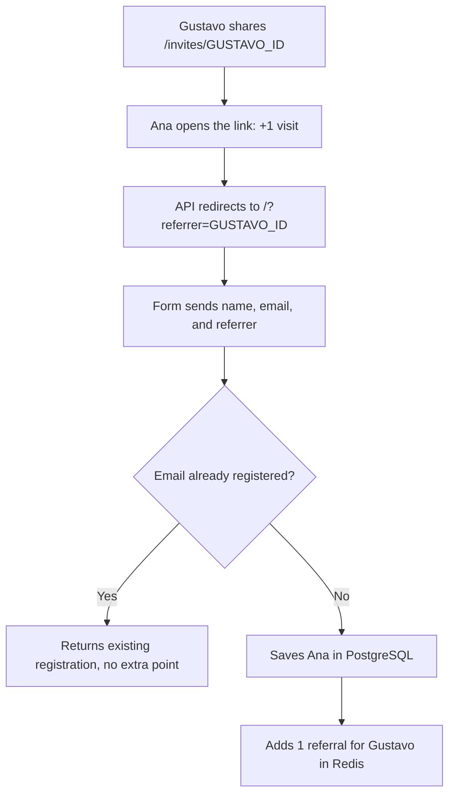

# How does it work? (Overview)

[English](README.md) · [Português (Brasil)](README.pt-BR.md) · [Español](README.es.md)

**Your link contains your identifier. When someone opens it, that identifier travels with them until they submit the form. When saving a new registration, the API uses that value to credit you with a referral.**

Here from the question on LinkedIn? Let's follow an example: Gustavo shares his link, and Ana registers through it.

## 1. Your registration generates an identifier

When Gustavo registers, he receives a `subscriberId`: his unique registration identifier, generated in PostgreSQL as a UUID. The frontend uses this value to build his invitation link.

For readability, we will represent that UUID as `GUSTAVO_ID`. In the default local environment, the link shared by the interface looks like this:

```text
http://localhost:4200/invites/GUSTAVO_ID
```

The path `/invites/GUSTAVO_ID` reaches the API through the frontend proxy. You can also access the route directly on the API, on port `3333`.

## 2. Ana opens the link and carries the identifier to the form

The API receives the visit at `GET /invites/:subscriberId`, adds one visit to Gustavo's link counter in Redis, and responds with an HTTP `302` redirect to the registration page:

```text
http://localhost:4200/?referrer=GUSTAVO_ID
```

The destination address comes from the `WEB_URL` setting. The `?referrer=GUSTAVO_ID` part is a URL parameter identifying who sent the invitation.

**At this point, Gustavo has gained one link visit. The referral will only count if a new registration is created.**

## 3. The form sends the referrer's identifier

The frontend reads the `referrer` parameter from the URL. When Ana enters her name and email and confirms her registration, it includes this identifier in the body of the `POST /subscriptions` request:

```json
{
  "name": "Ana Silva",
  "email": "ana@example.com",
  "referrer": "GUSTAVO_ID"
}
```

Ana does not need to enter who invited her: the interface has already read that information from the link.

## 4. The API saves the registration and adds the point

The API looks up the submitted email in PostgreSQL:

- If the email is already registered, it returns the existing identifier without creating another registration or awarding another referral.
- If the email is new, it saves the registration. When a `referrer` is present, it adds one point for that identifier to the Redis leaderboard.

The route passes the `referrer` field to the registration function as `referrerId`. This is the code that adds the point:

```ts
if (referrerId) {
  await redis.zincrby('referral:ranking', 1, referrerId)
}
```

Ana therefore receives her own registration identifier, while Gustavo's score increases by one.



## What if someone only clicks or comes back later?

| Situation | Current behavior |
| --- | --- |
| Opens the invitation without registering | Counts a visit without awarding a referral. |
| Opens the same invitation several times | Each request to the route counts; visits are not deduplicated per person. |
| Completes a new registration with your `referrer` | Awards you one referral. |
| Submits an already registered email | Returns the existing registration without awarding another point. |
| Visits the page directly without `referrer` | Can register, but no referral is attributed. |
| Closes the page and later returns without the parameter | The previous referral is not recovered: this flow does not persist the referrer in a cookie or local storage. |

In this project, attribution depends on the `referrer` submitted with the registration. The API currently does not validate whether that identifier belongs to an existing participant or require a previous click. The parameter can be changed; it represents the reported source, but does not prove who shared the link.

PostgreSQL stores registrations, while Redis stores counters and the leaderboard. The current implementation does not store a permanent relationship to Gustavo in Ana's registration: it maintains the referrer's accumulated score.

## Where does this happen in the code?

- [Registration identifier](../../src/drizzle/schema/subscriptions.ts): UUID generated in the database.
- [Link building and registration submission](../../frontend/src/app/api.ts): `inviteUrl` and `subscribe` methods.
- [Invitation access and redirect](../../src/routes/access-invite-link-route.ts): adds `referrer` to the destination URL.
- [Visit counting](../../src/functions/access-invite-link.ts): increments `referral:access-count`.
- [Reading the parameter in the form](../../frontend/src/app/registration.ts): captures `referrer` and sends it with the name and email.
- [Registration route](../../src/routes/subscribe-to-event-route.ts): receives `referrer` and passes it along as `referrerId`.
- [Registration and scoring](../../src/functions/subscribe-to-event.ts): checks the email, saves the registration, and increments `referral:ranking`.

[Back to the main README](../../README.md)
