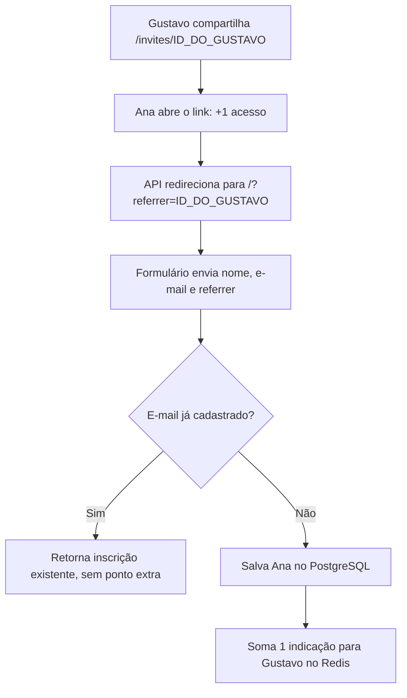

# Como isso funciona? (visão geral)

[English](README.md) · [Português (Brasil)](README.pt-BR.md) · [Español](README.es.md)

**Seu link contém o seu identificador. Quando alguém abre esse link, o identificador acompanha a pessoa até o envio do formulário. Ao salvar uma nova inscrição, a API usa esse valor para somar uma indicação para você.**

Veio pela pergunta no LinkedIn? Vamos acompanhar um exemplo: Gustavo compartilha seu link e Ana se inscreve por ele.

## 1. Seu cadastro gera um identificador

Ao se cadastrar, Gustavo recebe um `subscriberId`: o identificador único da sua inscrição, gerado no PostgreSQL como UUID. O frontend usa esse valor para montar seu link de convite.

Para facilitar a leitura, vamos representar esse UUID como `ID_DO_GUSTAVO`. No ambiente local padrão, o link compartilhado pela interface fica assim:

```text
http://localhost:4200/invites/ID_DO_GUSTAVO
```

O caminho `/invites/ID_DO_GUSTAVO` chega à API pelo proxy do frontend. Também é possível acessar a rota diretamente na API, na porta `3333`.

## 2. Ana abre o link e leva o identificador até o formulário

A API recebe o acesso em `GET /invites/:subscriberId`, soma um acesso ao link de Gustavo no Redis e responde com um redirecionamento HTTP `302` para a página de inscrição:

```text
http://localhost:4200/?referrer=ID_DO_GUSTAVO
```

O endereço de destino vem da configuração `WEB_URL`. O trecho `?referrer=ID_DO_GUSTAVO` é um parâmetro da URL que informa quem fez o convite.

**Nesse momento, Gustavo ganhou um acesso ao link. A indicação só será contabilizada se houver uma nova inscrição.**

## 3. O formulário envia quem fez o convite

O frontend lê o parâmetro `referrer` da URL. Quando Ana preenche nome e e-mail e confirma sua inscrição, ele inclui esse identificador no corpo da requisição `POST /subscriptions`:

```json
{
  "name": "Ana Silva",
  "email": "ana@example.com",
  "referrer": "ID_DO_GUSTAVO"
}
```

Ana não precisa digitar quem a convidou: a interface já leu essa informação do link.

## 4. A API salva a inscrição e soma o ponto

A API procura o e-mail recebido no PostgreSQL:

- Se o e-mail já estiver cadastrado, retorna o identificador existente, sem criar outra inscrição nem somar uma indicação.
- Se for um novo e-mail, salva a inscrição. Quando há um `referrer`, soma um ponto para esse identificador no ranking do Redis.

A rota passa o campo `referrer` para a função de cadastro com o nome `referrerId`. O trecho que soma o ponto é:

```ts
if (referrerId) {
  await redis.zincrby('referral:ranking', 1, referrerId)
}
```

Assim, Ana recebe seu próprio identificador de inscrição, enquanto a pontuação de Gustavo aumenta em um.



## E se a pessoa só clicar ou voltar depois?

| Situação | Comportamento atual |
| --- | --- |
| Abre o convite e não se cadastra | Conta um acesso, sem somar indicação. |
| Abre o mesmo convite várias vezes | Cada acesso à rota conta; não há deduplicação por pessoa. |
| Conclui uma nova inscrição com seu `referrer` | Soma uma indicação para você. |
| Envia um e-mail já cadastrado | Retorna a inscrição existente, sem pontuar novamente. |
| Entra diretamente na página, sem `referrer` | Pode se cadastrar, mas não atribui indicação. |
| Fecha a página e depois volta sem o parâmetro | A indicação anterior não é recuperada: este fluxo não persiste o indicador em cookie ou armazenamento local. |

Neste projeto, a atribuição depende do `referrer` enviado no cadastro. A API atualmente não valida se esse identificador pertence a um participante existente nem exige um clique anterior. O parâmetro pode ser alterado; ele indica a origem informada, mas não comprova quem compartilhou o link.

O PostgreSQL guarda as inscrições, e o Redis guarda os contadores e o ranking. A implementação atual não grava na inscrição de Ana uma relação permanente com Gustavo: mantém a pontuação acumulada de quem indicou.

## Onde isso acontece no código?

- [Identificador da inscrição](../../src/drizzle/schema/subscriptions.ts): UUID gerado no banco.
- [Montagem do link e envio do cadastro](../../frontend/src/app/api.ts): métodos `inviteUrl` e `subscribe`.
- [Acesso ao convite e redirecionamento](../../src/routes/access-invite-link-route.ts): inclui `referrer` na URL de destino.
- [Contagem de acessos](../../src/functions/access-invite-link.ts): incrementa `referral:access-count`.
- [Leitura do parâmetro no formulário](../../frontend/src/app/registration.ts): captura `referrer` e o envia com nome e e-mail.
- [Rota de inscrição](../../src/routes/subscribe-to-event-route.ts): recebe `referrer` e o repassa como `referrerId`.
- [Cadastro e pontuação](../../src/functions/subscribe-to-event.ts): verifica o e-mail, salva a inscrição e incrementa `referral:ranking`.

[Voltar ao README principal](../../README.md) · [Ver o README em português](../../README.pt-BR.md)
